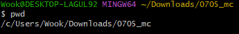
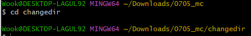
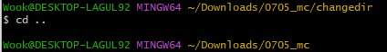
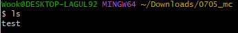
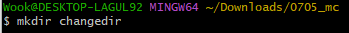
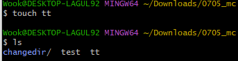
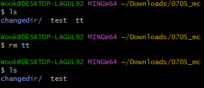

# 📌CLI

## 🏷️CLI < > GUI

| **`C` command - 명령**   | **`G` Graphic     - 그래픽** |
| ------------------------ | ---------------------------- |
| **`L` line - 줄**        | **`U` user  - 유저**         |
| **`I` interface - 조작** | **`I` interface  - 조작**    |

이제까지는 그래픽 유저 인터페이스에 익숙했지만, CLI 로 넘어온 이상 명령을 하고 

명령에 대한 결과를 반드시 읽어나가야 함.

## 🏷️디렉토리 관리 

`✔️원하는 폴더 위치에서 사용하는지 확인`					
`✔️띄어쓰기 주의 !공백을 표기 하려면  mkdir 새\폴더`							

|   **`pwd`**    | **** |
| :------------: | :----------------------------------------------------------: |
|    **`cd`**    | **** |
|  **`cd ..`**   |  |
|    **`ls`**    | **** |
|  **`mkdir`**   | **** |
|  **`touch`**   |  |
|    **`rm`**    |  |
|  **`rm -r`**   |             폴더 지울 때, R > recursive (재귀적)             |
| **`Ctrl + l`** |                            클리어                            |

