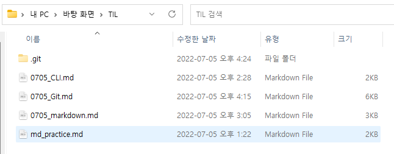

# Git 실습 

## 0.사전 설정 (PC 최초 한번)

 ```bash
   git config --global user.email "ifol1129@gmail.com"
   git config --global user.name "Wook"
 ```


##  1. 바탕화면에 TIL 폴더를 만든다.

- TIL 폴더를 열어서 마크다운 정리 파일을 옮긴다.
- VS Code를 연다



```bash
Wook@DESKTOP-LAGUL92 MINGW64 ~/Desktop/TIL
$ ls
0705_CLI.md  0705_Git.md  0705_markdown.md  md_practice.md
```


## 2. TIL 폴더에 git 저장소를 만들어 준다. 

`명령어`

```bash
$ git init
Initialized empty Git repository in C:/Users/Wook/Desktop/TIL/.git/
```

`git status`

```bash
$ git status
On branch master

No commits yet

Untracked files:
  (use "git add <file>..." to include in what will be committed)
        0705_CLI.md
        0705_Git.md
        0705_markdown.md
        md_practice.md

nothing added to commit but untracked files present (use "git add" to track)
```

`git log`

```bash
$ git log
fatal: your current branch 'master' does not have any commits yet
```

### git add

`명령어`

```bash
$ git add .
```

`git status`

```bash
$ git log
fatal: your current branch 'master' does not have any commits yet

Wook@DESKTOP-LAGUL92 MINGW64 ~/Desktop/TIL (master)
$ git add .

Wook@DESKTOP-LAGUL92 MINGW64 ~/Desktop/TIL (master)
$ git status
On branch master

No commits yet

Changes to be committed:
  (use "git rm --cached <file>..." to unstage)
        new file:   0705_CLI.md
        new file:   0705_Git.md
        new file:   0705_markdown.md
        new file:   md_practice.md
```

`git log`

```bash
$ git log
fatal: your current branch 'master' does not have any commits yet
```


## 3. 커밋을 만든다.

`명령어`

```bash
$ git commit -m '0705_정리'
[master (root-commit) 0dc7e2a] 0705_정리
 4 files changed, 437 insertions(+)
 create mode 100644 0705_CLI.md
 create mode 100644 0705_Git.md
 create mode 100644 0705_markdown.md
 create mode 100644 md_practice.md
```

`git status`

```bash
$ git status
On branch master
nothing to commit, working tree clean
```

`git log`

```bash
$ git log
commit 0dc7e2af9438ee197458aeecc9146cc3dbae84f5 (HEAD -> master)
Author: wook <ifol1129@gmail.com>
Date:   Tue Jul 5 16:29:52 2022 +0900

    0705_정리
```

