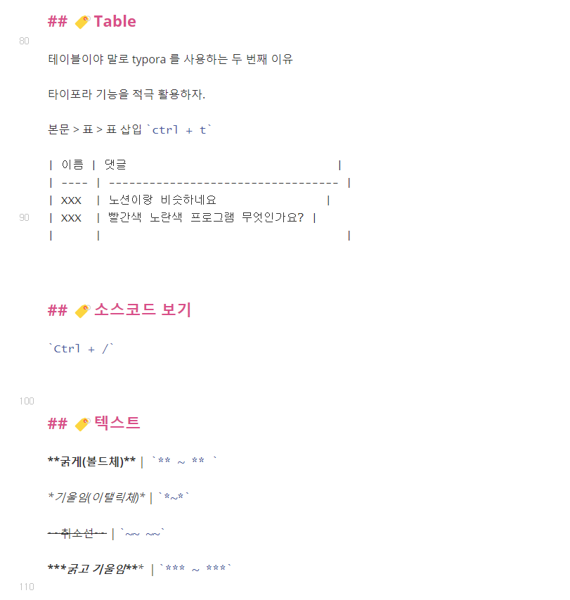
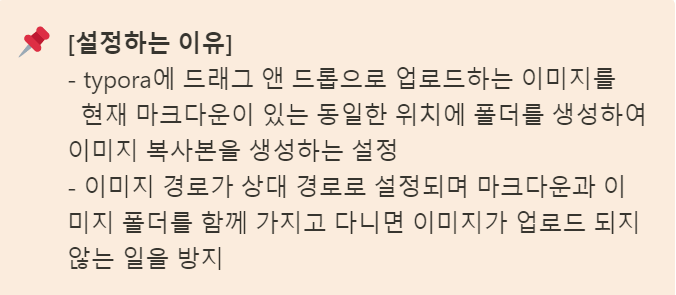

# 📌마크다운


## 🏷️제목 

# Heading Lv 1 `# `

## Heading Lv 2 ` ## `

### Heading Lv 3 `###`


## 🏷️리스트

1. 순서가 있는  | `1. `
2. 순서가 있는 | `2. `

- 순서가 없는 | ` - `
- 순서가 없는 | ` * `

> *목록 활용시 단계를  `tab`과 ` shift + tab` 으로 조절한다*


## 🏷️Fenced Code block

```python
print('hello world') # ```python 
```

```html
<h1> hi </h1> <!-- ```html  -->
```

탈출 |  `Ctrl + Enter`


## 🏷️Inline Code block

`backtick <내용> backtick`

At the command prompt, type `nano`


## 🏷️링크

[Github 링크](https://github.com) | `[표현할 글씨](URL)`

[마크다운 예시](./READMD.md) | `"." 현재폴더를 의미`

[이미지폴더](./images) | `./images` < 파일명을 가급적 영어로

[마크다운 실습](./md_practice.md) |`./md_practice.md`


## 🏷️이미지

``

위 처럼 하거나, 이미지를 끌어다 놓을 수 있음 ( 캡쳐 사용 시 `Ctrl  + V`)

- 절대 경로`(C:\Users\....\name.XXX)`   

- 상대 경로 `(name.asset/image.XXX)` 

마크다운 이미지가 안보이는 경우(github) >> Typora 설정




## 🏷️인용문

> 안녕 | `> 내용`
>
> 탈출 |  `enter + enter`


## 🏷️Table

테이블이야 말로 typora 를 사용하는 두 번째 이유

타이포라 기능을 적극 활용하자.

본문 > 표 > 표 삽입 | `ctrl + t`

| 이름 | 댓글                               |
| ---- | ---------------------------------- |
| XXX  | 노션이랑 비슷하네요                |
| XXX  | 빨간색 노란색 프로그램 무엇인가요? |


## 🏷️소스코드 보기

`Ctrl + /`



## 🏷️텍스트 

**굵게(볼드체)** |  `** ~ ** `

*기울임(이탤릭체)* | `*~*`

~~취소선~~ | `~~ - ~~`

***굵고 기울임***  | `*** ~ ***`


## 🏷️수평선

`---`

---

`***`

***

`___`

___


정렬, 색깔 기능 없음


## ❗ 띄어쓰기가 있는 것

- 제목(# )
- 목록 (`-`, `1.`)


## ❗ 띄어쓰기 없는 것

- 인라인 코드 블럭

- 기울임

- 굵게


## 🏷️기타 단축키

이모지 | `Win + .`

볼드체 | `Ctrl + b`

이탤릭 | `Ctrl + i `


